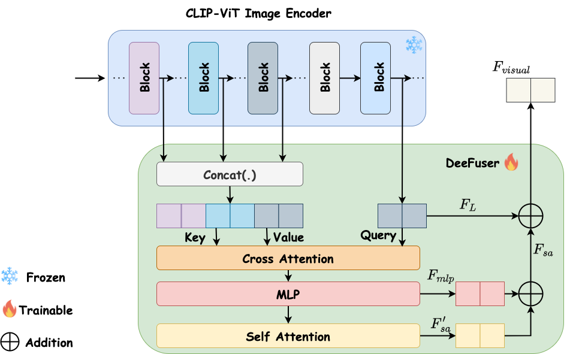

# DeeCLIP

☀️ If you find this work useful for your research, please kindly star our repo and cite our paper! ☀️

### TODO
We are working hard on following items.

- [ ] Release ArXiv paper
- [ ] Release training scripts
- [ ] Release inference scripts
- [ ] Release checkpoints

## Introduction

In this paper, we proposed DeeCLIP, a novel, robust, and generalizable transformer-based method for efficiently detecting AI-generated images. DeeCLIP incorporates two key components: (1) fine-tuning the CLIP-ViT image encoder using LoRA, a parameter-efficient fine-tuning technique, and (2) integrating both deep and shallow features from CLIP-ViT to preserve semantic alignment from deep layers while enriching representations with fine-grained details. In addition, we trained DeeCLIP end-to-end using triplet loss, which helps to better discriminate between authentic and AI-generated images by learning a more effective embedding space.


## DeeFuser




## :book: Citation
if you make use of our work, please cite our paper
```
@article{,
  title={DeeCLIP: A Robust Transformer-Based Approach for AI-Generated Image Detection},
  author={Keita, Mamadou and Hamidouche, Wassim and Bougueffa, Hassen and Hadid, Abdenour and Taleb-Ahmed, Abdelmalik},
  journal={},
  year={2025}
}
```
