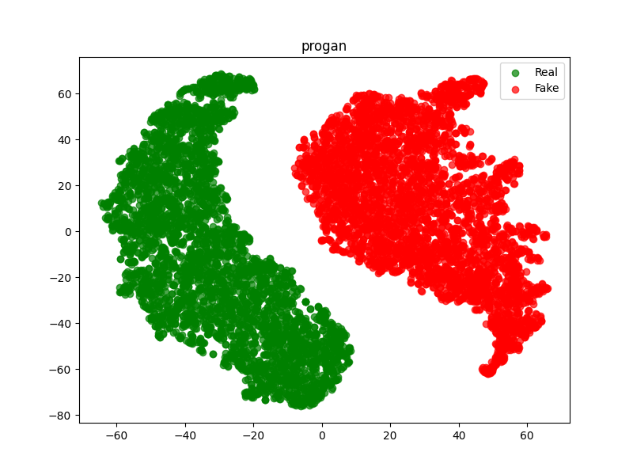
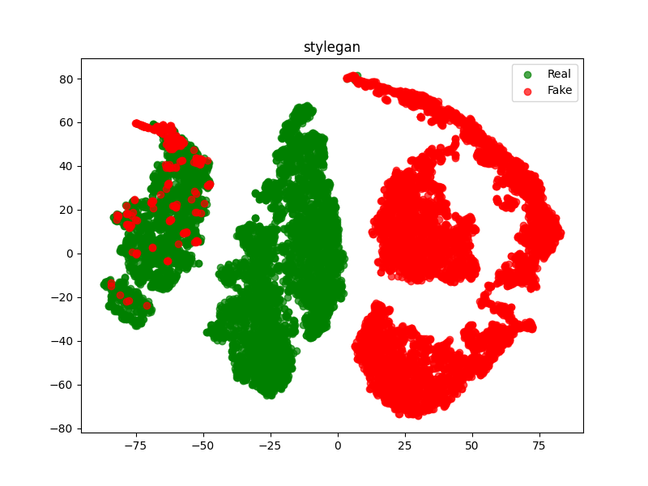
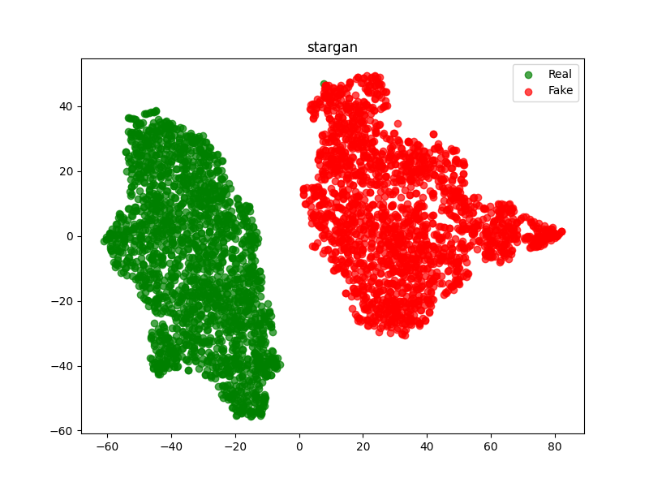
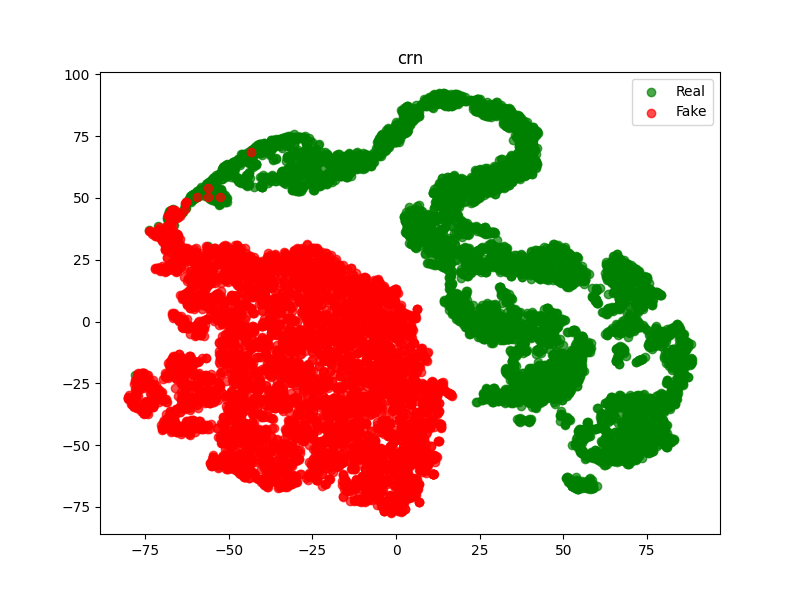
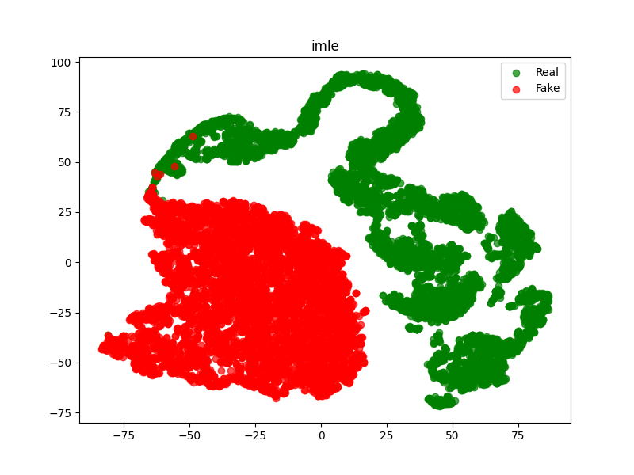
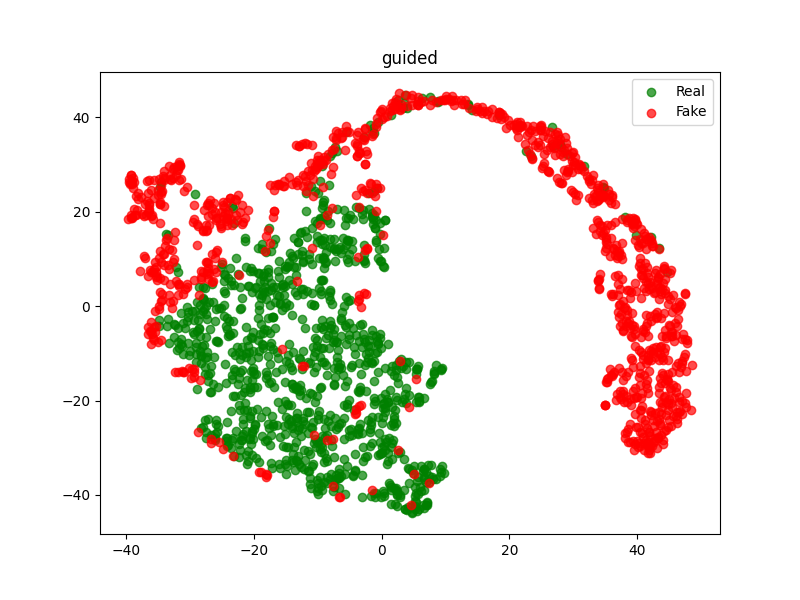
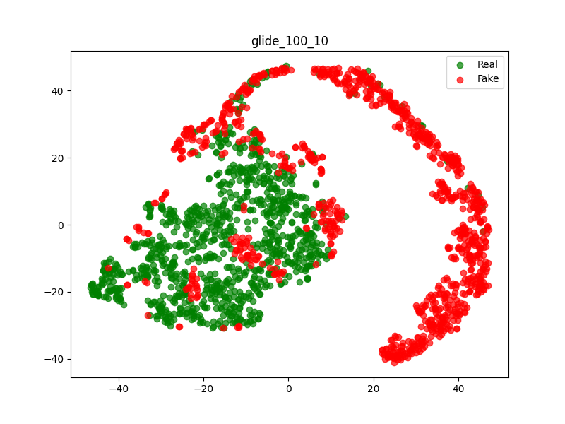
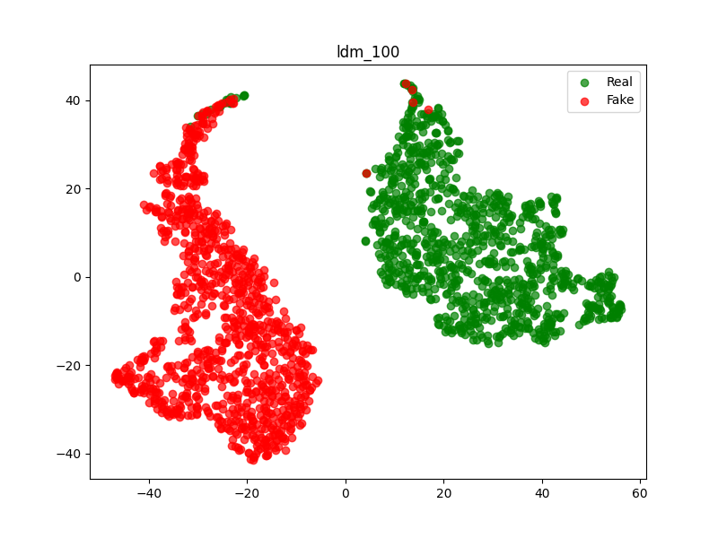

# DeeCLIP: A Robust and Generalizable Transformer-Based Framework for Detecting AI-Generated Images

☀️ If you find this work useful for your research, please kindly star our repo and cite our paper! ☀️

### TODO
We are working hard on the following items:

- [x] Release ArXiv paper  
- [ ] Release training scripts  
- [x] Release inference scripts  
- [x] Release checkpoints

# DeeCLIP

**DeeCLIP** is a novel framework for **detecting AI-generated images** using a combination of **CLIP-ViT** and **fusion learning**. As generative models continue to improve, detecting synthetic images becomes more challenging due to poor generalization and vulnerability to common image manipulations. DeeCLIP tackles these issues with a robust and adaptable architecture.

---

## 🔍 Overview

DeeCLIP enhances the detection of AI-generated images by integrating:

- ✅ **Zero-shot learning** via **CLIP-ViT** for model-agnostic generalization.
- 🧠 **LoRA-based fine-tuning** to efficiently adapt without forgetting.
- 🔀 **DeeFuser**: a custom fusion module combining deep and shallow features for post-processing robustness.
- 🎯 **Triplet loss** to structure the embedding space and improve the real vs. fake discrimination.

---

<p align="center">
  
</p>

## Requirements
``` python
pip install -r requirements.txt
```

## Download Model Weights

To use the model, download the weight and save it in the `weights` folder.

### **Automatic Download (Command Line)**
Run the following command in your terminal:

```sh
mkdir -p weights && wget -O weights/deeclip_weight_complete_with_lora_5.pth "https://www.dropbox.com/scl/fi/ttiqnbxu8atz4on5gqvgd/deeclip_weight_complete_with_lora_5.pth?rlkey=6xznuvriabkqfdcofhi1pbihu&st=fk02k7hf&dl=1"
```

## SOTA Detection Methods

- [C2P-CLIP](https://github.com/chuangchuangtan/C2P-CLIP-DeepfakeDetection)
- [RINE](https://github.com/mever-team/rine)
- [FatFormer](https://github.com/Michel-liu/FatFormer)
- [AntifakePrompt](https://github.com/nctu-eva-lab/antifakeprompt)
- [Bi-LORA](https://github.com/Mamadou-Keita/VLM-DETECT/)

## Evaluation
To run the test on specific dataset, use the following command:
```python
python testing.py
```

## T-SNE Plot of feature distribution

|  |  |  |  |
|------------------------|------------------------|------------------------|------------------------|
|  |  |  |  |


## Generalization Performance of Methods Trained on ProGAN

Results show accuracy (%) on real and synthetic data subsets.

| Methods   | Training Set | #params | MS COCO | Flickr | ControlNet | Dall3 | DiffusionDB | IF | LaMA | LTE | SD2Inpaint | SDXL | SGXL | SD3 | mAcc |
|-----------|-------------|---------|------------|-----------|--------------|----------|---------------|------|------|------|-------------|------|------|------|-----------|
| **FatFormer** | ProGAN | 493M | 33.97 | 34.04 | 28.27 | 32.07 | 28.10 | 27.95 | 28.67 | 12.37 | 22.63 | 31.97 | 22.23 | 35.91 | 28.18 |
| **RINE**      | ProGAN | 434M | 99.80 | 99.90 | 91.60 | 75.00 | 73.00 | 77.40 | 30.90 | 98.20 | 71.90 | 22.90 | 98.50 | 08.30 | 70.56 |
| **C2P-CLIP**  | ProGAN | 304M | 99.67 | 99.73 | 15.10 | 75.57 | 27.87 | 89.56 | 65.43 | 00.20 | 27.90 | 82.90 | 07.17 | 70.46 | 55.13 |
| **DecCLIP**   | ProGAN | 306M | 97.83 | 98.50 | 86.03 | 69.33 | 71.10 | 61.37 | 63.07 | 99.97 | 80.57 | 62.60 | 98.90 | 58.61 | **78.99** |


## :book: Citation
if you make use of our work, please cite our paper
```
@misc{keita2025deecliprobustgeneralizabletransformerbased,
      title={DeeCLIP: A Robust and Generalizable Transformer-Based Framework for Detecting AI-Generated Images}, 
      author={Mamadou Keita and Wassim Hamidouche and Hessen Bougueffa Eutamene and Abdelmalik Taleb-Ahmed and Abdenour Hadid},
      year={2025},
      eprint={2504.19876},
      archivePrefix={arXiv},
      primaryClass={cs.CV},
      url={https://arxiv.org/abs/2504.19876}, 
}
```
